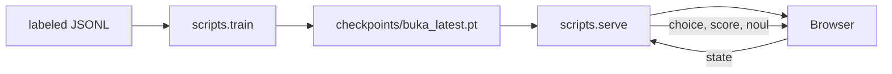

# buka-rs

**Train a small System One model from scratch: a message in, calibrated decisions out.**

[](https://www.python.org/downloads/)
[](https://pytorch.org/)
[](LICENSE)

Hands-on course: **open a notebook → implement the stub → expand solution only if stuck → run Check**. Reference library lives in `buka_rs/`. Capstone: **train → serve → decision page**.

Sibling of [buka](https://github.com/harrisonstark/buka) (a tiny causal LM that talks) and [buka-evo](https://github.com/harrisonstark/buka-evo) (LoRA on a ~3B instruct model). This one follows [Jev](https://typesafe.ai/blog/introducing-system-one-models-and-jev): no generated text. You send a state and get Choice, Score, and Noul answers with probabilities.

---

## What you are building

Jev is a hosted model that reads unstructured state and returns typed decisions in one pass, with probabilities. It does not write a reply. Open-source servers that speak the same HTTP API do it by reading a large existing language model (DiffusionGemma, Qwen). Those weights do not fit a GTX 1080, and they do not show you the architecture.

This course trains the small version you can actually own:

- a bidirectional encoder (the whole message is visible)
- three heads on one pooled vector: **topic** (choice), **urgency** (score), **needs a reply** (noul)
- confidence from how peaked the distribution is
- a local page at `http://127.0.0.1:7860`

Your Discord chats with Luka are the **state**, after you label them. They are not a script the model learns to speak. Speaking as someone is what buka and buka-evo already do.

The frontier training method (RLCD) is not published in enough detail to copy. Lesson 10 is temperature scaling, which is the calibration step you can implement and test.

---

## What size fits

Machine this was sized for: **GTX 1080, 8 GB, float32**. Compute capability 6.1 has no tensor cores, so float16 is not faster. The card is not the limit. Labeled text is. A local monologue export is about **3 MB** (a few million bytes). That supports a small decision model, not a frontier one.

| Preset | Params | When |
|---|---|---|
| `tiny` | 0.90M | Start here. Sample file, or your first labeled export. |
| `small` | 5.2M | More labeled states than the sample. |
| `stretch` | 14.3M | Still an easy float32 fit. Only worth it with a lot more labels. |

Details: [docs/model_size.md](docs/model_size.md).

---

## Learning outcomes

- Explain why a System One model drops the causal mask and the token loop
- Implement bidirectional attention, RMSNorm, SwiGLU, and a pad-aware mean pool
- Return Choice, Score, and Noul from one forward pass
- Train those heads from scratch and soften them with a temperature
- Serve the decisions in a browser

---

## Who it's for

| | |
|--|--|
| **Time** | ~1 weekend crash, or ~2 weeks paced ([COURSE.md](COURSE.md)) |
| **Hardware** | GTX 1080 / 8 GB is enough; CPU is fine for the notebooks and the tiny preset |
| **OS** | Windows / Linux / macOS (GPU path documented for CUDA 11.8) |

---

## Requirements

- **Python** 3.11+
- **PyTorch** (install separately; CUDA 11.8 wheels for a Pascal GPU)
- Package deps from `pyproject.toml`: `pyyaml`, `fastapi`, `uvicorn`, `jupyter`, `pydantic`
- Dev extras: `pytest`, `ruff`

---

## Quick start

```powershell
python -m venv .venv
.\.venv\Scripts\Activate.ps1
pip install torch --index-url https://download.pytorch.org/whl/cu118
pip install -e ".[dev]"
python -m scripts.smoke_gpu
pytest

python -m scripts.train --config configs/tiny.yaml --calibrate
python -m scripts.serve --checkpoint checkpoints/buka_latest.pt
# → http://127.0.0.1:7860
```

Or on Windows: `.\scripts\setup_venv.ps1`.

Notebooks:

```powershell
python scripts/build_course_notebooks.py   # already generated in notebooks/
jupyter notebook notebooks
```

| # | Notebook | You implement |
|---|----------|----------------|
| [01](notebooks/01_setup.ipynb) | Setup | `cuda_report`, `course_dtype` |
| [02](notebooks/02_decisions.ipynb) | Choice, score, noul | `choice_probs`, `noul_prob`, `confidence` |
| [03](notebooks/03_bytes.ipynb) | Byte states | `clean_state`, `encode_state` |
| [04](notebooks/04_attention.ipynb) | Bidirectional attention | `bidirectional_attention` |
| [05](notebooks/05_block.ipynb) | Norm + SwiGLU | `rms_norm`, `swiglu` |
| [06](notebooks/06_pool.ipynb) | One vector | `mean_pool` |
| [07](notebooks/07_heads.ipynb) | Parallel heads | `choice_answer`, `score_answer`, `noul_answer` |
| [08](notebooks/08_data.ipynb) | Labeled JSONL | `parse_example` |
| [09](notebooks/09_train.ipynb) | Train step | `train_step` |
| [10](notebooks/10_calibrate.ipynb) | Temperature | `fit_temperature` |
| [11](notebooks/11_serve.ipynb) | **Capstone** | `response_payload` + train/serve |

---

## Architecture



More: [docs/ARCHITECTURE.md](docs/ARCHITECTURE.md) · [docs/system_one.md](docs/system_one.md).

---

## Data

| Path | Role |
|------|------|
| [`data/samples/demo_decisions.jsonl`](data/samples/demo_decisions.jsonl) | **Committed** synthetic labels |
| `data/processed/` | Your labeled export (gitignored) |

**Never commit Discord GDPR packages or personal chats.** See [SECURITY.md](SECURITY.md) and [docs/bring_your_own_data.md](docs/bring_your_own_data.md).

---

## Project layout

```
buka_rs/        # reference implementation (answer key)
notebooks/      # the course
scripts/        # train, serve, smoke_gpu, setup_venv, notebook builder
configs/        # tiny / small / stretch
data/samples/   # public labeled states
ui/             # decision page
docs/           # size, architecture, your own data
```

---

## Contributing & license

See [CONTRIBUTING.md](CONTRIBUTING.md). **MIT** ([LICENSE](LICENSE)).
