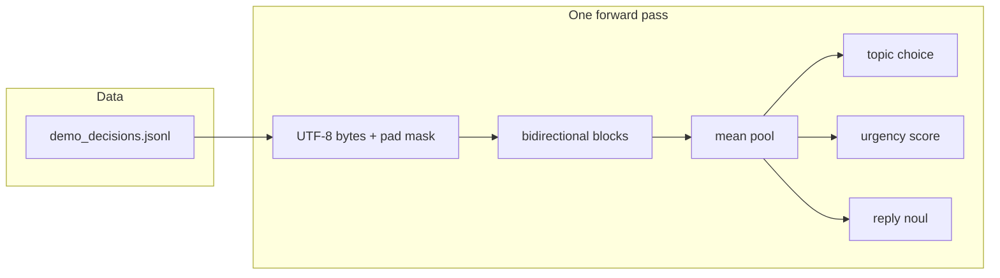

# Architecture

| Piece | File | Role |
|-------|------|------|
| Byte encode | `buka_rs/data.py` | state string → ids and pad mask |
| Attention | `buka_rs/attention.py` | full state visible; pad keys hidden |
| Block | `buka_rs/block.py` | RMSNorm, SwiGLU, mean pool |
| Heads | `buka_rs/model.py` | three linears on the pooled vector |
| Answers | `buka_rs/decisions.py` | softmax, sigmoid, confidence, temperature |
| Loop | `buka_rs/train.py` | sum of three losses |
| Page | `scripts/serve.py`, `ui/` | paste a state, read the answers |

Training labels are the decisions. Serving does not wrap the text in `User:` / `Buka:` lines. That wrapper belongs to the chat models.
